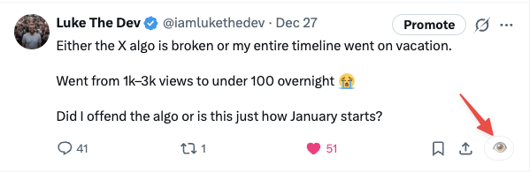

# X ViewLess

Hide view counts on X (Twitter) and get AI-powered reply suggestions using OpenAI.

## 🔒 Privacy & Security

**Your data stays on your device. We don't store anything.**

- ✅ **API keys are stored locally** in your browser's Chrome sync storage only
- ✅ **No data collection** — we don't track, store, or transmit any of your personal information
- ✅ **No server required** — all processing happens in your browser
- ✅ **Direct API calls** — your OpenAI API key is sent directly to OpenAI's API, never through any intermediate server
- ✅ **Open source** — you can review all the code to verify our privacy claims
- ✅ **No analytics** — we don't use any tracking or analytics services

**We have zero access to:**

- Your OpenAI API key
- Your tweets or replies
- Your personal context or settings
- Any data from X/Twitter

Everything is stored locally in your browser and only you have access to it.

## 📦 Installation

1. Open Chrome and navigate to `chrome://extensions/`
2. Enable **Developer mode** (toggle in the top right corner)
3. Click **Load unpacked** and select this `extension/` folder
4. The X ViewLess extension should now appear in your extensions list

## ⚙️ Setup

### Initial Configuration

1. **Open the extension options:**

   - Click on the X ViewLess extension icon in your Chrome toolbar, or
   - Right-click the extension icon and select **Options**

2. **Enter your OpenAI API Key** (required):

   - Get your API key from [OpenAI's API keys page](https://platform.openai.com/api-keys)
   - Paste it into the "OpenAI API Key" field
   - The field is password-masked for security

3. **Configure other settings** (all optional):

   - **Model**: Default is `gpt-4o` (you can use other models like `gpt-3.5-turbo`)
   - **System Instruction**: Custom instructions that guide how the AI writes replies
   - **Personal Context**: Your "memory" — background info about you that helps personalize replies
   - **Default Tone**:
     - **Neutral**: Professional and balanced
     - **Friendly**: Warm and approachable
     - **Dry Sarcastic**: Witty and sharp
   - **Default Reply Style**:
     - **Short**: Concise, to the point
     - **Medium**: Balanced length
     - **Spicy**: More engaging and expressive
   - **Temperature**: Controls creativity (0 = deterministic, 2 = very creative). Default: 0.7
   - **Max Output Tokens**: Maximum length of AI responses. Default: 120
   - **Character Limit**: Enforced when "Allow longer" is unchecked. Default: 280
   - **Show AI Reply button**: Toggle to show or hide the AI Reply button in reply composers. Default: hidden
   - **Hide view counts**: Toggle to hide view counts on your own posts
   - **Hide my own follower count**: Toggle to hide the follower count on your own profile page
   - **Hide other users' follower counts**: Toggle to hide follower counts when viewing other users' profile pages

4. Click **Save Settings**

## 🚀 Usage

### Using AI Reply Suggestions

1. **Enable the AI Reply button:**

   - Go to extension options
   - Check "Show AI Reply button"
   - Save settings

2. **Navigate to X (Twitter):**

   - Go to [x.com](https://x.com) and log in

3. **Open a reply composer:**

   - Click the reply button on any tweet
   - The reply composer will open

4. **Find the AI Reply button:**

   - Look for the green **AI Reply** button near the composer actions (usually next to the "Post" button)
   - The button appears automatically when you open a reply composer

5. **Generate a reply:**

   - Click the **AI Reply** button
   - The X ViewLess modal will open
   - The AI will immediately start generating a suggested reply based on:
     - The tweet you're replying to
     - The author's username and display name
     - Your default tone and style settings
     - Your personal context (if configured)

6. **Customize the reply:**

   - **Tone**: Change between Neutral, Friendly, or Dry Sarcastic
   - **Style**: Adjust between Short, Medium, or Spicy
   - **Allow longer**: Uncheck to enforce your character limit
   - **Regenerate**: Click to generate a new reply with the same settings

7. **Edit if needed:**

   - The generated reply is editable — feel free to modify it
   - The textarea supports full editing

8. **Insert and post:**
   - Click **Insert into X** to paste the reply into the composer
   - Review the reply in the composer
   - Post when ready!

### Using View Count Hiding

1. **Enable the feature:**

   - Go to extension options
   - Check "Hide view counts on my own posts"
   - Save settings

2. **How it works:**

   - View counts on your own posts will be automatically hidden
   - A toggle button (👁️) will appear where the view count was
   - Click the button to temporarily show the view count
   - Click again to hide it

3. **Privacy benefit:**
   - Reduces anxiety from constantly checking view counts
   - Helps you focus on creating content rather than metrics

### Using Follower Count Hiding

1. **Enable the feature:**

   - Go to extension options
   - Check "Hide my own follower count" to hide follower counts on your profile
   - Check "Hide other users' follower counts" to hide follower counts on other profiles
   - Save settings

2. **How it works:**

   - Follower counts will be automatically hidden on profile pages based on your settings
   - Works on your own profile when "Hide my own follower count" is enabled
   - Works on other users' profiles when "Hide other users' follower counts" is enabled
   - The hiding happens automatically when you visit a profile page

3. **Privacy benefit:**
   - Reduces comparison anxiety and social pressure
   - Helps you focus on content and connections rather than numbers
   - Creates a more mindful social media experience

## 📝 Important Notes

- **This extension uses the OpenAI API directly** — it does not use ChatGPT consumer or ChatGPT Memories
- The **Personal Context** setting is your replacement for "memory" in this extension
- Your API key is stored locally in Chrome's sync storage and is never shared
- API usage will be billed to your OpenAI account according to their pricing
- The extension works entirely client-side — no data leaves your browser except API calls to OpenAI

## 🔧 Troubleshooting

### "API key not configured" error

- **Solution**: Open the extension options and enter your OpenAI API key
- Make sure you've saved the settings after entering the key

### Button not appearing

- **Solution**: Make sure "Show AI Reply button" is enabled in extension settings
- Refresh the page; X's UI is dynamic and the observer may need a moment to detect the composer
- Try closing and reopening the reply composer
- Make sure you're on x.com (not twitter.com)

### Reply not inserting

- **Solution**: Try clicking inside the composer first, then use "Insert into X"
- If that doesn't work, the reply is copied to your clipboard — just paste it manually (Cmd+V / Ctrl+V)

### View counts not hiding

- **Solution**: Make sure "Hide view counts" is enabled in settings
- Refresh the page after enabling the setting
- The feature only works on your own posts

### Follower counts not hiding

- **Solution**: Make sure the appropriate follower count hiding option is enabled in settings
- Refresh the page after enabling the setting
- Make sure you're on a profile page (not the home timeline)
- The feature distinguishes between your own profile and other users' profiles based on your settings

### AI replies not generating

- **Solution**: Check that your OpenAI API key is valid and has credits
- Verify your internet connection
- Check the browser console (F12) for error messages

## 📁 Files

- `manifest.json` — Chrome extension manifest (MV3)
- `content.js` — Injected into x.com, handles button injection, modal, and view count hiding
- `openai.js` — OpenAI API helper for generating replies
- `options.html/js/css` — Settings page for configuration

## 🤝 Contributing

This is an open-source project. Feel free to:

- Report bugs
- Suggest features
- Submit pull requests
- Review the code for security

## 📄 License

This project is open source. Check the repository for license details.

---

Made with 🌿 by X ViewLess

Powered by [iamlukethedev](https://x.com/iamlukethedev)
